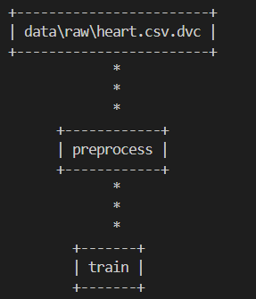
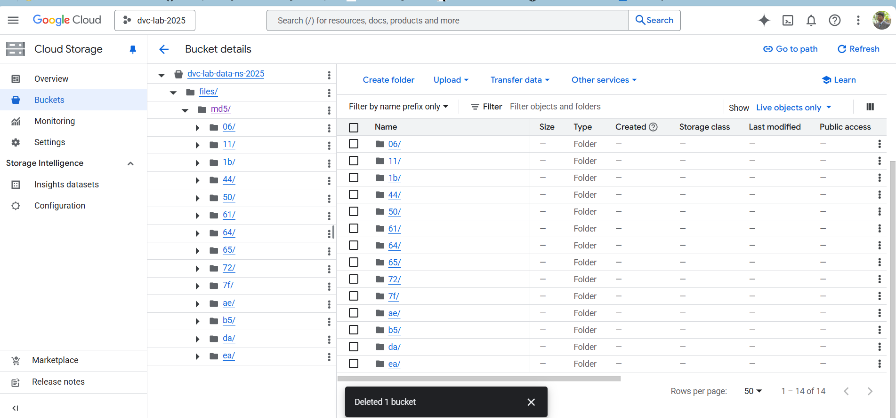
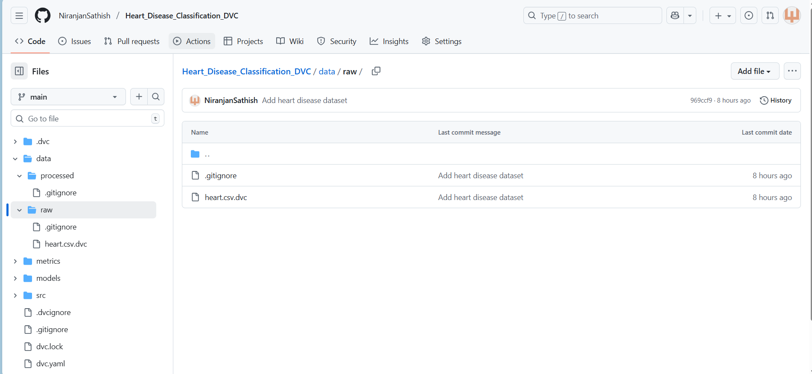
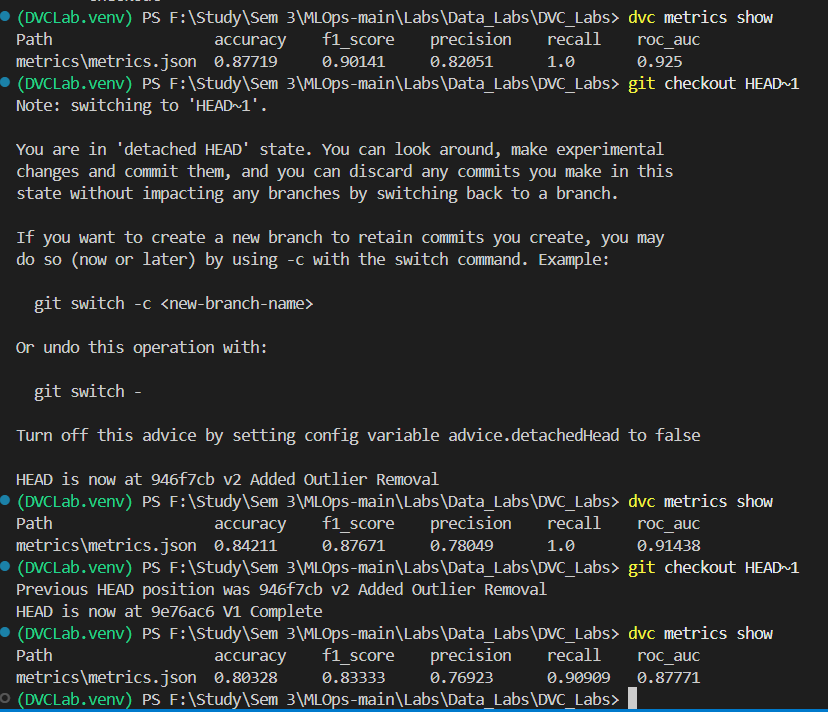

# Heart Disease Prediction with DVC Pipeline - DVC Lab1

A  complete machine learning project demonstrating Data Version Control (DVC) lab with Google Cloud Storage for reproducible ML experiments.

## 🎯 Project Overview

This project predicts heart disease using patient health metrics through Random Forest ML model. It demonstrates the use of DVC with proper version control for both code and data.

### Dataset
- **Source**: UCI Heart Disease Dataset
- **Samples**: 303 patients
- **Features**: 13 clinical features (age, blood pressure, cholesterol, etc.)
- **Target**: Binary classification (disease present or not)

##  Project Structure
```
.
├── data/
│   ├── raw/              # Original dataset (tracked by DVC)
│   └── processed/        # Processed data (tracked by DVC)
├── models/               # Trained models (tracked by DVC)
├── metrics/              # Performance metrics
├── src/
│   ├── preprocess.py     # Data preprocessing
│   └── train.py          # Model training
├── dvc.yaml              # DVC pipeline definition
├── dvc.lock              # DVC pipeline lock file
├── params.yaml           # Hyperparameters
└── README.md
```

##  Setup Instructions

### Prerequisites
```bash
pip install dvc[gs] pandas scikit-learn pyyaml
```

### Clone and Setup
```bash
# Clone repository
git clone https://github.com/NiranjanSathish/Heart_Disease_Classification_DVC
cd dvc-heart-disease-lab

# Copy GCP credentials file to project root
# Place your gcp-credentials.json in the project directory

# Pull data from GCS
dvc pull
```

## ☁️ Google Cloud Storage Setup

This project uses Google Cloud Storage (GCS) as the remote storage backend for DVC. Follow these steps to set up your own GCS bucket and credentials.

### Prerequisites
- Google Cloud Platform account
- A GCP project created

### Step 1: Create GCS Bucket

1. Go to [Google Cloud Console](https://console.cloud.google.com/)
2. Navigate to **Cloud Storage** → **Buckets**
3. Click **Create Bucket**
4. Configure bucket:
   - **Bucket name**: `dvc-heart-disease-<your-name>` (must be globally unique)
   - **Region**: `us-east1`
   - **Storage class**: Standard
   - **Access control**: Uniform
5. Click **Create**

### Step 2: Create Service Account & Get Credentials

1. In Google Cloud Console, go to **IAM & Admin** → **Service Accounts**
2. Click **Create Service Account**
3. Configure service account:
   - **Name**: `dvc-lab-heart-disease`
   - **Description**: Service account for DVC data versioning
4. Click **Create and Continue**
5. Grant access:
   - **Role**: Select **Storage Admin** (or **Owner** for broader access)
6. Click **Continue** → **Done**
7. Download credentials:
   - Click on your newly created service account email
   - Go to the **Keys** tab
   - Click **Add Key** → **Create New Key**
   - Choose **JSON** format
   - Click **Create** (JSON file downloads automatically)

### Step 3: Configure DVC with GCP Credentials

1. Move the downloaded JSON file to your project root directory:
```bash
   # Rename to gcp-credentials.json for consistency
   mv ~/Downloads/dvc-lab-heart-disease-*.json ./gcp-credentials.json
```

2. **IMPORTANT**: Add credentials to `.gitignore` (already included in this repo):
```bash
   # .gitignore already contains:
   gcp-credentials.json
```

3. Configure DVC remote (already configured in this repo):
```bash
   # This has already been done, but for reference:
   dvc remote add -d myremote gs://dvc-heart-disease-<your-name>
   dvc remote modify myremote credentialpath gcp-credentials.json
```

4. Verify configuration:
```bash
   cat .dvc/config
```
   
   Should output:
```
   [core]
       remote = myremote
   ['remote "myremote"']
       url = gs://dvc-heart-disease-<your-name>
       credentialpath = gcp-credentials.json
```

### Step 4: Test Connection
```bash
# Push data to GCS
dvc push

# Verify files in bucket
# Go to Cloud Console → Storage → Your Bucket
# You should see hashed files
```

### Security Notes

⚠️ **NEVER commit `gcp-credentials.json` to Git!**

- The credentials file contains sensitive authentication information
- It's already added to `.gitignore` in this project
- Each team member should use their own credentials file
- For production, consider using Google Cloud Workload Identity or service account impersonation

### Sharing with Team Members

When team members clone this repository:

1. They need to obtain their own `gcp-credentials.json` file (follow Step 2 above)
2. Place it in the project root
3. DVC will automatically use it to authenticate with GCS
4. Run `dvc pull` to download data

Alternatively, if working on the same team:
- Share the same service account JSON file securely (via encrypted channels, not Git)
- Or create individual service accounts for each team member with appropriate permissions

### Troubleshooting

**Error: "Failed to push data to the remote"**
- Verify your credentials file path is correct
- Check that the service account has Storage Admin role
- Ensure the bucket name in `.dvc/config` matches your actual bucket

**Error: "Bucket not found"**
- Verify the bucket name is correct in `.dvc/config`
- Check that you're using the correct GCP project
- Ensure the bucket exists in GCS Console

**Error: "Permission denied"**
- Verify the service account has sufficient permissions (Storage Admin or Owner)
- Check that the credentials JSON file is valid and not expired

##  Running the Pipeline

### Run entire pipeline
```bash
dvc repro
```

### View metrics
```bash
dvc metrics show
```

### Compare experiments
```bash
dvc metrics diff
```

## Experiment Versions

This project demonstrates three iterations of data preprocessing and their impact on model performance:

### Version 1: Baseline
- Basic preprocessing with duplicate removal
- Standard scaling of features
- Train/test split with stratification
- **Metrics**: Run `git checkout HEAD~2 && dvc checkout && dvc metrics show`

### Version 2: Outlier Removal
- IQR-based outlier detection on numerical features
- Removes extreme values from: age, blood pressure, cholesterol, max heart rate, ST depression
- Improved data quality
- **Metrics**: Run `git checkout HEAD~1 && dvc checkout && dvc metrics show`

### Version 3: Feature Engineering (Current)
- Includes all Version 2 improvements
- **New Features**:
  - `age_group`: Categorical age groups (0-40, 40-55, 55-70, 70+)
  - `high_chol`: Binary indicator for high cholesterol (>240)
  - `high_bp`: Binary indicator for high blood pressure (>140)
  - `hr_reserve`: Heart rate reserve (max heart rate - age)
  - `risk_score`: Combined risk score from multiple factors
- **Metrics**: Run `dvc metrics show`

## 🔀 Switching Between Versions
```bash
# View commit history
git log --oneline

# Switch to Version 1 (baseline)
git checkout HEAD~2
dvc checkout
dvc metrics show

# Switch to Version 2 (outlier removal)
git checkout HEAD~1
dvc checkout
dvc metrics show

# Return to Version 3 (latest - feature engineering)
git checkout main
dvc checkout
dvc metrics show
```

## 📈 Pipeline Stages

### Stage 1: Preprocess
- **Input**: `data/raw/heart.csv`
- **Output**: 
  - `data/processed/X_train.csv`
  - `data/processed/X_test.csv`
  - `data/processed/y_train.csv`
  - `data/processed/y_test.csv`
- **Dependencies**: `src/preprocess.py`, parameters from `params.yaml`
- **Purpose**: Data cleaning, outlier removal, feature engineering, scaling

### Stage 2: Train
- **Input**: Processed data from Stage 1
- **Output**: 
  - `models/model.pkl` (trained Random Forest model)
  - `metrics/metrics.json` (performance metrics)
- **Dependencies**: `src/train.py`, parameters from `params.yaml`
- **Purpose**: Model training and evaluation

##  Collaboration Workflow

Team members can reproduce experiments exactly:
```bash
# Clone the repository
git clone https://github.com/YOUR_USERNAME/dvc-heart-disease-lab.git
cd dvc-heart-disease-lab

# Add GCP credentials
# (Place gcp-credentials.json in project root)

# Pull all data and models from GCS
dvc pull

# Reproduce the entire pipeline
dvc repro

# Verify identical results
dvc metrics show
```

## 🛠️ Tech Stack

- **DVC**: Data & model versioning, pipeline automation
- **Git**: Code versioning
- **Google Cloud Storage**: Remote storage for data and models
- **scikit-learn**: Machine learning framework (Random Forest Classifier)
- **pandas**: Data manipulation and analysis
- **PyYAML**: Parameter management

##  Model Details

- **Algorithm**: Random Forest Classifier
- **Hyperparameters** (in `params.yaml`):
  - `n_estimators`: 100
  - `max_depth`: 10
  - `random_state`: 42
- **Evaluation Metrics**:
  - Accuracy
  - Precision
  - Recall
  - F1 Score
  - ROC AUC

# Screenshots

### 1.  Dependency Graph (`dvc dag`)
Visual representation of how data flows from raw input to the trained model.


### 2. Cloud Storage Integration
All dataset versions and trained models are automatically synced to a GCS bucket.


### 3. Tracking
Repository structure: Git tracks metadata (.dvc), while actual data is ignored.


### 3. Project Metrics
Model performance is tracked in JSON format for every version.
